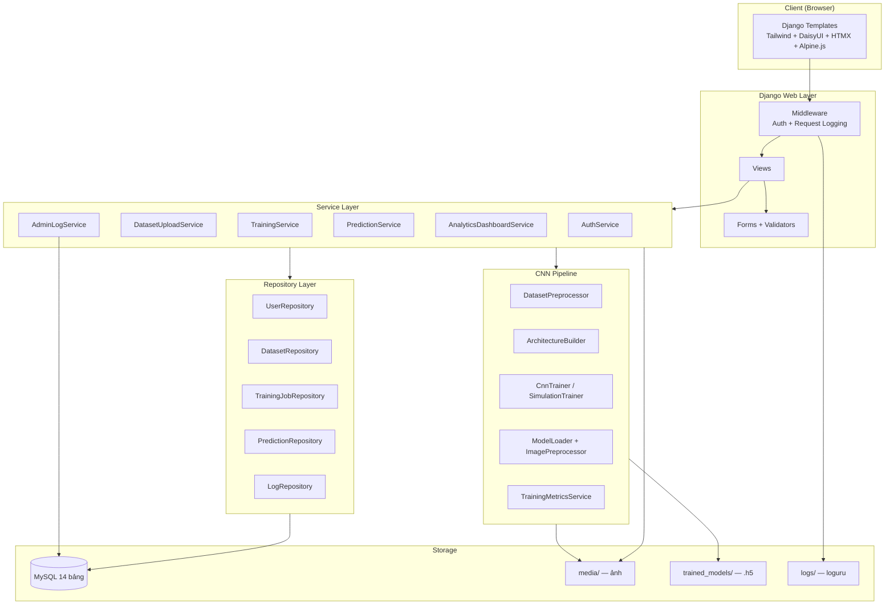
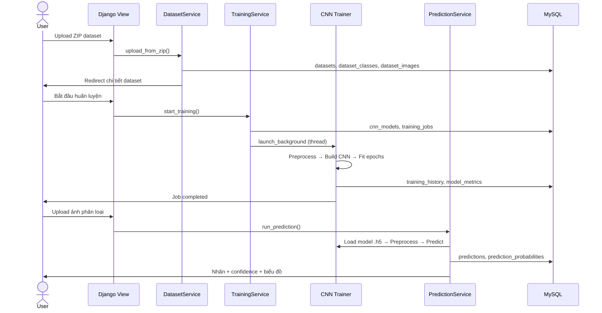

# Kiến trúc hệ thống — CNN Vision Platform

## Tổng quan

Hệ thống phân lớp theo mô hình **Django MVT + Service Layer + Repository Pattern**, tách biệt rõ presentation, business logic và data access.



## Luồng End-to-End (CNN Pipeline)



## Cấu trúc thư mục theo tầng

```
my-project/
├── apps/
│   ├── authentication/     # Phase 1
│   │   ├── views.py        # Presentation
│   │   ├── services/       # Business logic
│   │   └── repositories/   # Data access
│   ├── datasets/           # Phase 2
│   ├── training/           # Phase 3
│   │   └── services/cnn/   # AI Pipeline
│   │       ├── preprocessor.py
│   │       ├── architecture_builder.py
│   │       ├── trainer.py
│   │       └── simulation_trainer.py
│   ├── models_ai/          # Phase 4
│   ├── predictions/        # Phase 5-6
│   │   └── services/cnn/
│   │       └── image_preprocessor.py
│   ├── analytics/          # Phase 7
│   └── monitoring/         # Phase 8-9
├── core/
│   ├── middleware/         # Auth + Request logging
│   ├── permissions/        # @login_required, @admin_required
│   ├── enums/              # TrainingStatus, UserRole, LogLevel
│   └── logging/            # loguru config
├── templates/              # UI Aurora theme
├── static/                 # CSS, JS, Chart.js
├── media/                  # Ảnh dataset & prediction
└── trained_models/         # File model .h5
```

## CNN Pipeline chi tiết

### 1. Tiền xử lý dataset (`DatasetPreprocessorService`)

- Validate ảnh hỏng / không đọc được
- Resize về `input_width × input_height`
- Chuẩn hóa pixel về `[0, 1]`
- Chia train/validation (80/20)

### 2. Kiến trúc CNN (`ArchitectureBuilder`)

```
Input (H×W×3)
  → Conv2D + ReLU + MaxPooling
  → Conv2D + ReLU + MaxPooling
  → Flatten
  → Dense + ReLU
  → Dense (softmax) → Output classes
```

### 3. Huấn luyện (`CnnTrainerService` / `SimulationTrainerService`)

| Chế độ | Service | Mô tả |
|--------|---------|-------|
| Thật | `CnnTrainerService` | TensorFlow/Keras fit model |
| Mô phỏng | `SimulationTrainerService` | Sinh metrics giả lập, không cần GPU |

Sau huấn luyện:
- Lưu file `.h5` vào `trained_models/`
- Ghi `training_history` (accuracy/loss từng epoch)
- Tính `model_metrics` (accuracy, precision, recall, F1, confusion matrix)

### 4. Inference (`PredictionService`)

```
Upload ảnh
  → ImagePreprocessor (resize, normalize)
  → ModelLoader (load .h5)
  → model.predict()
  → Top-K probabilities
  → Lưu predictions + image_preprocessing_logs
```

## Middleware stack

| Thứ tự | Middleware | Chức năng |
|--------|-----------|-----------|
| 1 | SecurityMiddleware | HTTPS headers |
| 2 | CommonMiddleware | URL normalization |
| 3 | CsrfViewMiddleware | CSRF protection |
| 4 | MessageMiddleware | Flash messages (cookie) |
| 5 | AuthenticationMiddleware | Signed cookie session |
| 6 | RequestLoggingMiddleware | Log endpoint, status, thời gian |

## Phân quyền

| Vai trò | Quyền |
|---------|-------|
| `user` | Dataset, training, predict, history, analytics (của mình) |
| `admin` | Tất cả quyền user + `/admin-panel/*` |

Decorator: `@login_required`, `@admin_required` trong `core/permissions/decorators.py`.

## Công nghệ sử dụng

| Tầng | Công nghệ |
|------|-----------|
| Frontend | Django Templates, Tailwind CSS, DaisyUI, HTMX, Alpine.js, Chart.js, GSAP |
| Backend | Django 4.2, Service Layer, Repository |
| AI/ML | TensorFlow/Keras, Pillow, scikit-learn, Matplotlib, Seaborn |
| Database | MySQL (PyMySQL) |
| Logging | loguru, psutil |
| Auth | Custom User model + signed cookie (không dùng django.contrib.auth) |

## Mở rộng tương lai

- **Celery + Redis** — Huấn luyện async thực sự (hiện dùng threading)
- **REST API** — `/api/v2/*` cho mobile/frontend tách biệt
- **Docker** — Container hóa deploy
