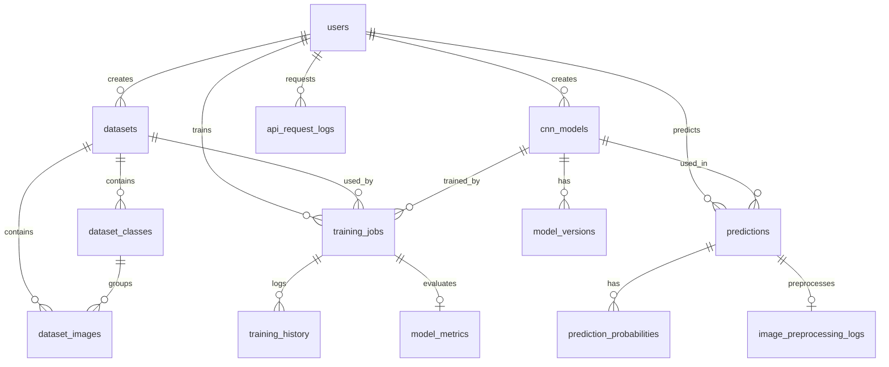

# ERD — CNN Vision Platform (14 bảng)

Tài liệu thiết kế cơ sở dữ liệu MySQL cho hệ thống phân loại ảnh CNN.

## Sơ đồ quan hệ (ERD)



## Danh sách 14 bảng

| STT | Bảng | Phase | Mô tả |
|-----|------|-------|-------|
| 1 | `users` | 1 | Người dùng hệ thống (user/admin) |
| 2 | `datasets` | 2 | Metadata bộ dữ liệu huấn luyện |
| 3 | `dataset_classes` | 2 | Nhãn/class trong dataset |
| 4 | `dataset_images` | 2 | Metadata ảnh thuộc dataset |
| 5 | `cnn_models` | 3 | Mô hình CNN đã huấn luyện |
| 6 | `training_jobs` | 3 | Job huấn luyện |
| 7 | `model_metrics` | 3 | Metrics đánh giá (accuracy, F1, confusion matrix) |
| 8 | `training_history` | 3 | Accuracy/loss theo từng epoch |
| 9 | `predictions` | 5 | Kết quả phân loại ảnh |
| 10 | `prediction_probabilities` | 5 | Xác suất từng class (Top-K) |
| 11 | `image_preprocessing_logs` | 5 | Log tiền xử lý ảnh trước inference |
| 12 | `model_versions` | 4 | Phiên bản file model `.h5` |
| 13 | `system_logs` | 9 | Log hệ thống (error, training, prediction) |
| 14 | `api_request_logs` | 9 | Log HTTP request (endpoint, status, thời gian) |

---

## Chi tiết từng bảng

### 1. `users`

| Cột | Kiểu | Mô tả |
|-----|------|-------|
| id | BIGINT PK | ID tự tăng |
| username | VARCHAR(50) UNIQUE | Tên đăng nhập |
| email | VARCHAR(100) UNIQUE | Email |
| password | VARCHAR(255) | Mật khẩu hash |
| full_name | VARCHAR(100) | Họ tên |
| avatar_url | VARCHAR(500) | URL avatar |
| role | VARCHAR(20) | `user` / `admin` |
| is_active | BOOLEAN | Trạng thái kích hoạt |
| last_login | DATETIME | Lần đăng nhập cuối |
| created_at | DATETIME | Ngày tạo |
| updated_at | DATETIME | Ngày cập nhật |

### 2. `datasets`

| Cột | Kiểu | Mô tả |
|-----|------|-------|
| id | BIGINT PK | |
| dataset_name | VARCHAR(100) | Tên bộ dữ liệu |
| dataset_slug | VARCHAR(100) UNIQUE | Slug duy nhất |
| description | TEXT | Mô tả |
| dataset_path | VARCHAR(500) | Đường dẫn lưu trữ |
| total_images | INT | Tổng số ảnh |
| total_classes | INT | Tổng số class |
| created_by | FK → users | Người tạo |
| is_active | BOOLEAN | Trạng thái |
| created_at | DATETIME | |

### 3. `dataset_classes`

| Cột | Kiểu | Mô tả |
|-----|------|-------|
| id | BIGINT PK | |
| dataset_id | FK → datasets | Bộ dữ liệu |
| class_name | VARCHAR(100) | Tên class |
| class_slug | VARCHAR(100) | Slug class |
| total_images | INT | Số ảnh trong class |
| created_at | DATETIME | |

### 4. `dataset_images`

| Cột | Kiểu | Mô tả |
|-----|------|-------|
| id | BIGINT PK | |
| dataset_id | FK → datasets | |
| class_id | FK → dataset_classes | Class thuộc về |
| image_name | VARCHAR(255) | Tên file |
| image_url | VARCHAR(500) | URL ảnh |
| image_format | VARCHAR(20) | png, jpg, ... |
| mime_type | VARCHAR(50) | MIME type |
| width, height, channels | INT | Kích thước ảnh |
| file_size | BIGINT | Dung lượng (bytes) |
| is_train | BOOLEAN | Thuộc tập train |
| created_at | DATETIME | |

### 5. `cnn_models`

| Cột | Kiểu | Mô tả |
|-----|------|-------|
| id | BIGINT PK | |
| model_name | VARCHAR(100) | Tên model |
| model_slug | VARCHAR(100) UNIQUE | Slug |
| architecture_type | VARCHAR(100) | Kiến trúc (cnn_basic) |
| description | TEXT | Mô tả |
| framework | VARCHAR(50) | tensorflow |
| input_width, input_height | INT | Kích thước input |
| channels | INT | Kênh màu (3) |
| total_parameters | BIGINT | Số tham số |
| model_file_path | VARCHAR(500) | Đường dẫn file .h5 |
| model_size_mb | FLOAT | Dung lượng |
| version | VARCHAR(50) | Phiên bản hiện tại |
| is_active | BOOLEAN | |
| created_by | FK → users | |
| created_at | DATETIME | |

### 6. `training_jobs`

| Cột | Kiểu | Mô tả |
|-----|------|-------|
| id | BIGINT PK | |
| model_id | FK → cnn_models | Model đang huấn luyện |
| dataset_id | FK → datasets | Dataset sử dụng |
| trained_by | FK → users | Người huấn luyện |
| training_status | VARCHAR(20) | pending/training/completed/failed |
| status_message | TEXT | Thông báo trạng thái |
| epochs, batch_size | INT | Hyperparameters |
| learning_rate | FLOAT | |
| optimizer, loss_function | VARCHAR | |
| train/validation accuracy, loss | FLOAT | Kết quả cuối |
| execution_time | FLOAT | Thời gian (giây) |
| started_at, finished_at | DATETIME | |
| created_at | DATETIME | |

### 7. `model_metrics`

| Cột | Kiểu | Mô tả |
|-----|------|-------|
| id | BIGINT PK | |
| training_job_id | FK → training_jobs | |
| accuracy | FLOAT | |
| precision_score | FLOAT | |
| recall_score | FLOAT | |
| f1_score | FLOAT | |
| confusion_matrix_json | JSON | Ma trận nhầm lẫn |
| class_labels_json | JSON | Nhãn class |
| created_at | DATETIME | |

### 8. `training_history`

| Cột | Kiểu | Mô tả |
|-----|------|-------|
| id | BIGINT PK | |
| training_job_id | FK → training_jobs | |
| epoch_number | INT | Số epoch |
| train_accuracy, validation_accuracy | FLOAT | |
| train_loss, validation_loss | FLOAT | |
| created_at | DATETIME | |

### 9. `predictions`

| Cột | Kiểu | Mô tả |
|-----|------|-------|
| id | BIGINT PK | |
| model_id | FK → cnn_models | Model dùng để predict |
| predicted_by | FK → users | Người thực hiện |
| image_name | VARCHAR(255) | Tên ảnh |
| image_url | VARCHAR(500) | URL ảnh đã lưu |
| predicted_class | VARCHAR(100) | Nhãn dự đoán |
| confidence_score | FLOAT | Độ tin cậy |
| top_k | INT | Số class trả về |
| inference_time_ms | FLOAT | Thời gian inference |
| is_simulation | BOOLEAN | Chế độ mô phỏng |
| created_at | DATETIME | |

### 10. `prediction_probabilities`

| Cột | Kiểu | Mô tả |
|-----|------|-------|
| id | BIGINT PK | |
| prediction_id | FK → predictions | |
| class_name | VARCHAR(100) | Tên class |
| probability | FLOAT | Xác suất (0–1) |
| rank_order | INT | Thứ hạng Top-K |

### 11. `image_preprocessing_logs`

| Cột | Kiểu | Mô tả |
|-----|------|-------|
| id | BIGINT PK | |
| prediction_id | FK → predictions (1-1) | |
| original_width, original_height | INT | Kích thước gốc |
| target_width, target_height | INT | Kích thước sau resize |
| channels | INT | |
| normalize_scale | FLOAT | Hệ số chuẩn hóa (1/255) |
| created_at | DATETIME | |

### 12. `model_versions`

| Cột | Kiểu | Mô tả |
|-----|------|-------|
| id | BIGINT PK | |
| model_id | FK → cnn_models | |
| version_name | VARCHAR(100) | Tên phiên bản |
| version_number | VARCHAR(50) | Số version |
| model_path | VARCHAR(500) | Đường dẫn file |
| accuracy_score | FLOAT | Accuracy của version |
| is_production | BOOLEAN | Version đang dùng |
| created_at | DATETIME | |

### 13. `system_logs`

| Cột | Kiểu | Mô tả |
|-----|------|-------|
| id | BIGINT PK | |
| level | VARCHAR(20) | debug/info/warning/error |
| source | VARCHAR(100) | Nguồn log |
| message | TEXT | Nội dung |
| stack_trace | TEXT | Stack trace (nếu có) |
| context_json | JSON | Context bổ sung |
| created_at | DATETIME | |

### 14. `api_request_logs`

| Cột | Kiểu | Mô tả |
|-----|------|-------|
| id | BIGINT PK | |
| method | VARCHAR(10) | GET/POST/... |
| path | VARCHAR(500) | URL path |
| endpoint | VARCHAR(200) | Tên endpoint |
| status_code | INT | HTTP status |
| execution_time_ms | FLOAT | Thời gian xử lý |
| ip_address | VARCHAR(45) | IP client |
| user_id | FK → users (nullable) | User (nếu đã login) |
| created_at | DATETIME | |

---

## Quan hệ tóm tắt

```
users
 ├── datasets, cnn_models, training_jobs, predictions, api_request_logs
datasets
 ├── dataset_classes, dataset_images, training_jobs
cnn_models
 ├── training_jobs, predictions, model_versions
training_jobs
 ├── model_metrics, training_history
predictions
 ├── prediction_probabilities, image_preprocessing_logs
```

## Migration

Tất cả bảng được tạo qua Django migrations:

```powershell
python manage.py migrate
```

Không dùng bảng Django mặc định (`django_session`, `auth_user`, ...) — hệ thống dùng custom auth với signed cookie.
